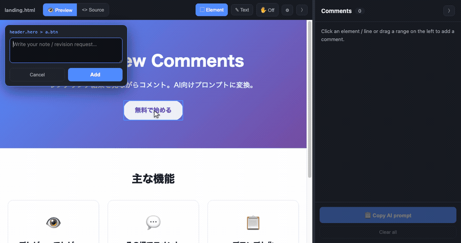
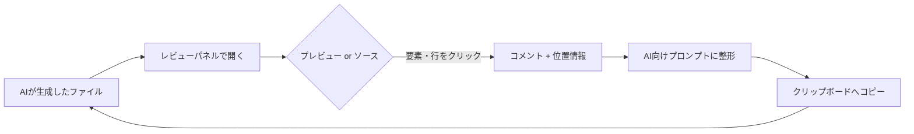

# AI Review Comments

[English](README.md) · **日本語**

任意のファイルをサイドパネルでレビューし、**レンダリング結果または生の行に
コメントを付けて、AI 向けの修正プロンプトをコピー**できる VS Code 拡張です。
コピーした内容は Claude Code / Copilot / ChatGPT などにそのまま貼り付けられます。



## コンセプト

AI に HTML ページや Markdown ドキュメントを生成させたとき——レビューは
**レンダリング結果（見た目）** を見て行いたいのに、修正させるには AI が
**ソース** を編集する必要があります。このギャップを埋めます。

1. **AI が生成したファイルをプレビューで開く**（HTML はそのまま、Markdown は
   `mermaid` 図を含めてレンダリング）。
2. **見ているものに直接コメント** — 要素や行をクリックして指摘を書く。
3. **コピー** — コメントが、対象を正確に指す（CSS セレクタ／ソース行／
   JSON・YAML のデータパス）プロンプトに整形され、貼り付け可能な形になります。



## 使い方

レンダリング結果にコメント → **Copy** → クリップボードには構造化された
プロンプト（ファイルパス・CSSセレクタ・ソース行・該当HTML・指摘）が入り →
AI に貼り付ければ、どこを直すか正確に伝わります（上のアニメーション参照）。

プレビューとソースはいつでも切替可能。どちらで付けたコメントも同期し、
同じ行を指します。


1. ファイルを右クリック → **AI Review: Open Review Panel**（エディタの横に開く）
2. **👁 Preview / `<>` Source** を切り替え（プレビューは HTML/Markdown のみ）
3. コメントを付ける:
   - **プレビュー**: 要素をクリック、または **✎ Text** で文章をドラッグ選択
   - **ソース**: 行をクリック、または範囲をドラッグ → その場の入力欄に記入
     （⌘/Ctrl+Enter で確定）
4. **📋 Copy AI prompt** を押して AI に貼り付け

## 機能

- **2 つのビューを自由に切替**（Obsidian 風）: レンダリング ⇄ 生ソース
- **コメントがソースに紐付く** — レンダリングされた見出しへのコメントは元の
  Markdown 行を、HTML 要素へのコメントはソース行と安定した CSS セレクタを記録
- **JSON/YAML のデータパス** — 行コメントが構造パス（例 `services.web.ports`）を取得
- **`mermaid` 図** を Markdown プレビューで描画
- **プロンプトテンプレート** — 修正 / 質問 / レビュー / プレーン、または
  `{{file}}` `{{count}}` `{{comments}}` で自作
- **ファイル単位で永続化**（ワークスペース）、**コピー**でクリップボードへ
- **リサイズ / 折りたたみ**対応・レスポンシブ

### 対応フォーマット

| ファイル | プレビュー | ソース |
|------|-----------|--------|
| `.html` `.htm` | ライブレンダリング・要素/テキストコメント | 生 HTML + 行番号 |
| `.md` `.markdown` | レンダリング（`mermaid` 含む）・要素/テキストコメント | 生 Markdown + 行番号 |
| `.json` `.yaml` `.xml` `.svg` `.txt` `.csv`・各種ソース | —（ソースのみ） | 行 + JSON/YAML データパス |

> Markdown プレビューは `mermaid` を CDN から読み込みます（要ネット接続）。
> 読み込めない場合は図のソースがテキストのまま表示されます。

## インストール

### パッケージ済み VSIX から（現在）

```bash
git clone https://github.com/ykitaza/ai-review-comments.git
cd ai-review-comments
npm install
npm run package          # → ai-review-comments-<version>.vsix
code --install-extension ai-review-comments-*.vsix
```

または VS Code で **拡張機能パネル → ··· → VSIX からインストール…**

### Marketplace から

_未公開です。_ 公開後は **「AI Review Comments」** で検索、または
`code --install-extension ykitaza.ai-review-comments`。

## 設定

| 設定 | 既定 | 説明 |
|------|------|------|
| `aiReviewComments.defaultTemplate` | `fix` | 既定のプロンプトテンプレート（`fix` / `question` / `review` / `plain`） |

## 開発

```bash
npm install
npm run watch        # 変更を監視して dist/ を再ビルド
npm run typecheck    # tsc --noEmit
npm run package      # .vsix を作成
```

VS Code で **F5** を押すと拡張機能の開発ホストが起動します。設計は
[docs/ARCHITECTURE.md](docs/ARCHITECTURE.md) を参照。

## ライセンス

[MIT](LICENSE)
