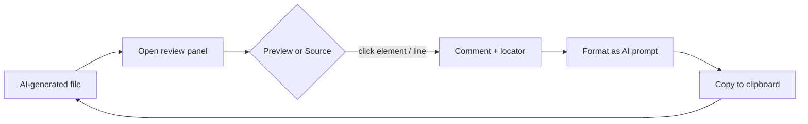

# AI Review Comments

**English** · [日本語](README.ja.md)

A VS Code extension to **review any file in a side panel, drop comments on the
rendered view or the raw lines, and copy an AI-ready revision prompt** you can
paste straight into Claude Code, Copilot, ChatGPT, etc.


## The idea

You ask an AI to generate an HTML page or a Markdown doc. To review it you want
to look at the **rendered result** — but to get it fixed, the AI needs to edit
the **source**. This extension closes that gap:

1. **Open the AI-generated file in a preview** (HTML renders; Markdown renders,
   including `mermaid` diagrams).
2. **Comment right on what you see** — click an element or a line and type your note.
3. **Copy** — your notes become a prompt that points the AI at the exact spot
   (CSS selector, source line, JSON/YAML data path) in a format ready to paste.



## How it works


1. Right-click a file → **AI Review: Open Review Panel** (opens beside the editor).
2. Toggle **👁 Preview / `<>` Source** (preview is available for HTML/Markdown).
3. Add comments:
   - **Preview:** click an element, or pick **✎ Text** and drag-select prose.
   - **Source:** click a line, or drag across a range; type in the inline box
     (⌘/Ctrl+Enter to save).
4. Press **📋 Copy AI prompt** and paste it to your AI assistant.

## Features

- **Two views, toggle freely** (Obsidian-style): rendered preview ⇄ raw source.
- **Comments map back to the source** — a note on a rendered heading records the
  original Markdown line; a note on an HTML element records its source line and
  a stable CSS selector.
- **Data paths for JSON/YAML** — commenting a line captures its structural path
  (e.g. `services.web.ports`).
- **`mermaid` diagrams** render inside Markdown preview.
- **Prompt templates** — *Fix / Question / Review / Plain*, or write your own
  with `{{file}}`, `{{count}}`, `{{comments}}` placeholders.
- **Persistence** per file (workspace state); **copy** to clipboard.
- **Resizable / collapsible**, responsive panel.

### Supported files

| File | Preview | Source |
|------|---------|--------|
| `.html` `.htm` | Live render, element/text comments | Raw HTML + line numbers |
| `.md` `.markdown` | Rendered (incl. `mermaid`), element/text comments | Raw Markdown + line numbers |
| `.json` `.yaml` `.xml` `.svg` `.txt` `.csv`, source files, … | — (source only) | Lines + JSON/YAML data paths |

> Markdown preview loads `mermaid` from a CDN (needs network); without it the
> diagram source stays visible as text.

## Install

### From a packaged VSIX (today)

```bash
git clone https://github.com/ykitaza/ai-review-comments.git
cd ai-review-comments
npm install
npm run package          # → ai-review-comments-<version>.vsix
code --install-extension ai-review-comments-*.vsix
```

Or in VS Code: **Extensions panel → ··· → Install from VSIX…**

### From the Marketplace

_Not published yet._ Once published: search **“AI Review Comments”**, or
`code --install-extension ykitaza.ai-review-comments`.

## Configuration

| Setting | Default | Description |
|---------|---------|-------------|
| `aiReviewComments.defaultTemplate` | `fix` | Default prompt template (`fix` / `question` / `review` / `plain`). |

## Development

```bash
npm install
npm run watch        # rebuild dist/ on change
npm run typecheck    # tsc --noEmit
npm run package      # build a .vsix
```

Press **F5** in VS Code to launch an Extension Development Host. See
[docs/ARCHITECTURE.md](docs/ARCHITECTURE.md) for the design.

## License

[MIT](LICENSE)
