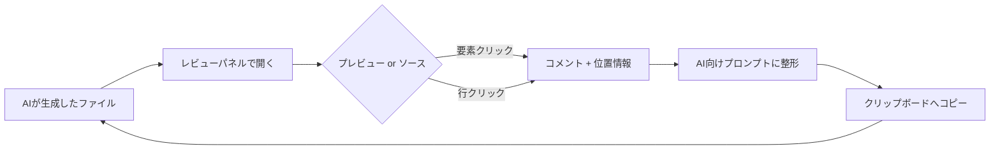

# AI Review Comments — 設計ドキュメント（サンプル）

これは拡張機能 **AI Review Comments** を試すためのサンプル設計ドキュメントです。
このファイル自体をレビューパネルで開き、見出しや段落をクリックしてコメントを
付けてみてください。

## このツールが解決する課題

AI にドキュメントや UI を生成させる機会が増えました。ところが——

- レビューは **レンダリング結果**（整形された見た目）を見て行いたい
- でも修正指示は **元のソース**（行・要素）に対して正確に行う必要がある

この「見た目とソースのギャップ」を埋めるのがこのツールです。

## 使い方の流れ

1. ファイルを右クリック → **AI Review: Open Review Panel**
2. プレビューで気になる箇所をクリックしてコメント
3. **Copy AI prompt** で、位置情報付きのプロンプトをコピー
4. AI に貼り付けて修正してもらう

## 対応フォーマット

| 種別 | プレビュー | コメント単位 |
|------|-----------|-------------|
| Markdown | レンダリング（mermaid 対応） | 要素 / 行 |
| HTML | ライブレンダリング | 要素 / 行 |
| JSON / YAML ほか | （ソースのみ） | 行（データパス付き） |

## アーキテクチャ概要

> ヒント: プレビューで付けたコメントは、元の Markdown の行番号にも紐付きます。
> 「ソース」表示に切り替えると同じ箇所に表示されます。
